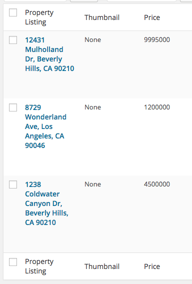
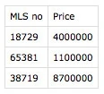
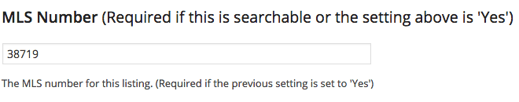
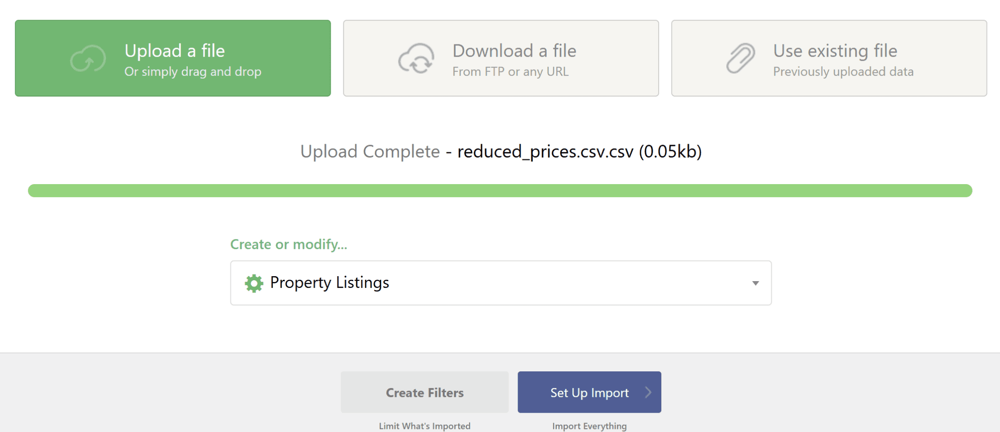
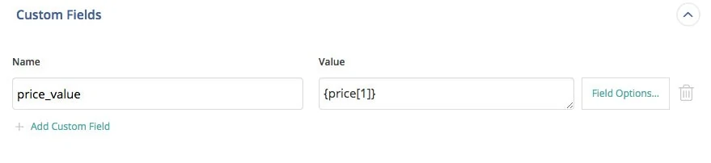
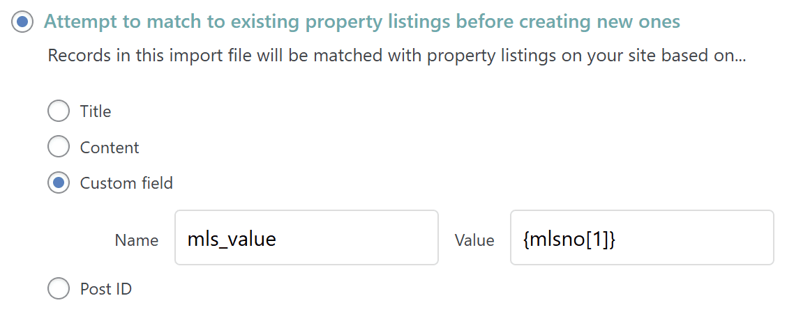
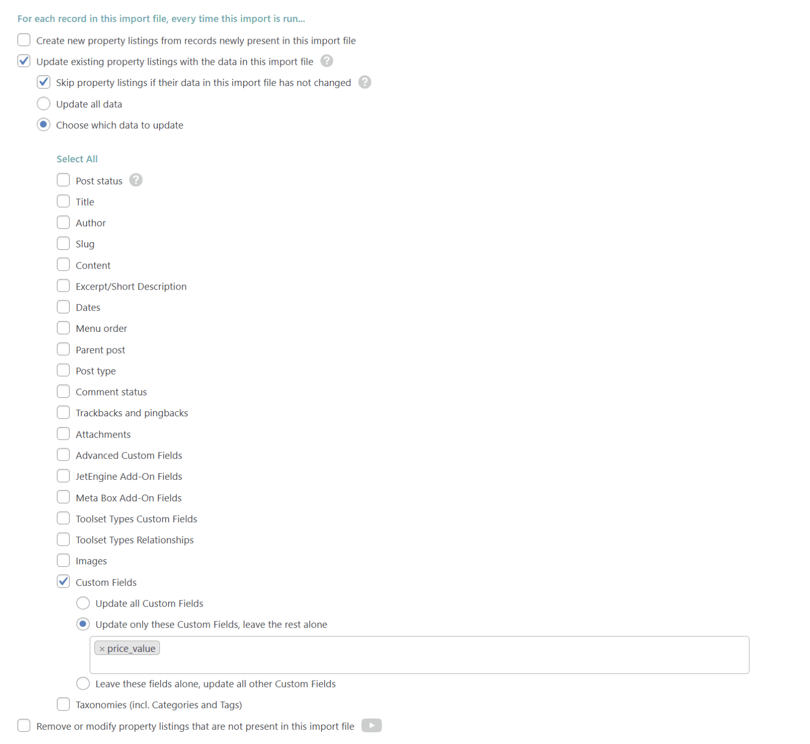
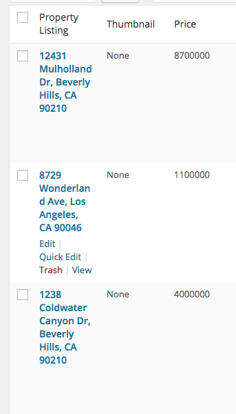

# How to Update Existing WordPress Data

To update existing WordPress data, create an import via All Import › New Import.

Provide your import file, choose the required post type, then configure WP All Import to match with existing records.

## Table of Contents

How Updating WordPress Data Works

 Step 1: Understanding the Import Data

 Step 2: Set Up the Import

 Step 3: Fill In Data to Update

 Step 4: Specify Key Import Settings

## Update WordPress Data – How It Works

WP All Import can import data to posts that already exist on your site, even if they were manually created instead of imported by our plugin.

You need something in your import file that WP All Import can use to match the “records” in your import file to the posts that already exist on your site — that’s why it's also called Manual Record Matching.

When importing into existing records, you can specify which data WP All Import will update or overwrite, and which will be left alone.

Follow along with the example below to get a complete understanding of how to import data into existing posts.

## Step 1: Understanding the Import Data

This example will demonstrate how to update multiple property listings with new prices.

As shown in the screenshots, we have a few property listings with outdated prices.

I have a CSV file with the MLS numbers of the properties and the new prices.

I’ve entered the MLS number of each property in my theme. This means we can use the MLS number as the “matcher” so that WP All Import knows which price should be assigned to which property.

## Step 2: Set Up the Import

To create the import, navigate to All Import › New Import, upload your CSV file, and select Property Listings as the post type.

Click Set Up Import to continue.

## Step 3: Fill In Data to Update in the Import Template

In the Drag & Drop section, set the price custom field to the price from your file.

The only field we want to import data to is the price, so leave all the other fields blank.

WP All Import will warn you that your post title and content are blank, but that’s fine — you can continue anyway.

Click Continue to Import Settings at the bottom.

## Step 4: Specify Important Import Settings

Now it’s time for the most important part — telling WP All Import how to match the records in our CSV file with the existing property listings already on our site.

We’re going to match by the MLS number since we have the MLS number both on our site and in our import file.

### Define How to Match with Existing Data

In Import Settings, select “Attempt to match to existing WordPress posts before creating new ones.”

Choose to match based on Custom field and click the Name box. Then enter mls_value, which is the custom field used to store the MLS number for each property.

Next, drag & drop the MLS column from your CSV file to the Value textbox.

For each record in your file, our plugin will look for a property on your site with an mls_value custom field that equals the same as {mlsno[1]} from your file, and then import the price to it.

If you have multiple records or properties with this same value, only the first found record will be matched and updated. To match multiple properties that have the exact same mls_value custom field and value, custom code would have to be used along with our API.

### Tell WP All Import Exactly Which Fields to Update

To ensure our plugin only imports the price and doesn’t overwrite the title, content, and other fields that we left empty, specify which data points to update and which to ignore.

For this example, we are updating only the price_value custom field:

If the custom field to update doesn’t appear in the dropdown list, you can type it in and hit Return/Enter to add it.

This step is very important. If you choose to update all data without having data mapped, you risk erasing existing data from your posts. You should only continue after having defined exactly which fields to update.

Once everything is set up, click Continue and then Confirm & Run Import.

After running the import, here’s the result: our three posts were updated with the new prices.

That’s how you use Manual Record Matching.
